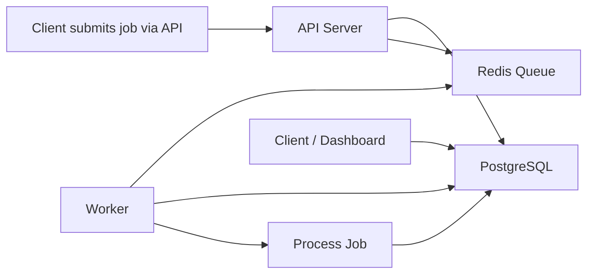

# Architecture Documentation

System architecture and internal components of GoQueue.

## System Overview



## Current Architecture (Phase 1)

```
┌─────────────┐
│   Client    │
└──────┬──────┘
       │ HTTP
       ▼
┌─────────────────────────────────┐
│       API Server (Gin)          │
│  ┌──────────────────────────┐   │
│  │  Job Handler             │   │
│  │  (HTTP Request/Response) │   │
│  └────────┬─────────────────┘   │
│           │                     │
│  ┌────────▼─────────────────┐   │
│  │  Job Service             │   │
│  │  (Business Logic)        │   │
│  └────────┬─────────────────┘   │
│           │                     │
│  ┌────────▼─────────────────┐   │
│  │  Job Repository          │   │
│  │  (Data Access)           │   │
│  └────────┬─────────────────┘   │
└───────────┼─────────────────────┘
            │
            ▼
     ┌──────────────┐
     │  PostgreSQL  │
     │   (GORM)     │
     └──────────────┘
```

## Repository Structure

```
goqueue/
├── cmd/
│   ├── api/              # API Server - separate binary
│   ├── worker/           # Worker Service - separate binary (planned)
│   └── scheduler/        # Scheduler Service - separate binary (planned)
├── internal/             # Shared internal code
│   ├── config/           # Configuration constants
│   │   └── constants.go  # Allowed queues and job types
│   ├── dto/              # Data Transfer Objects
│   │   ├── email.go      # Email job payload
│   │   ├── payment.go    # Payment job payload
│   │   ├── webhook.go    # Webhook job payload
│   │   └── job.go        # Job request/response DTOs
│   ├── job/              # Job domain logic
│   │   ├── interface.go          # Interface definitions
│   │   ├── job_handler.go        # HTTP handlers
│   │   ├── job_service.go        # Business logic
│   │   └── payload_validation.go # Payload validation
│   ├── models/           # Database models
│   │   └── job.go        # Job model
│   ├── mocks/            # Test mocks
│   │   ├── job_repo_mock.go
│   │   └── job_service_mock.go
│   └── storage/
│       └── postgres/     # PostgreSQL implementation
│           ├── connection.go     # DB connection
│           └── job_repo.go       # Repository
├── middleware/           # HTTP middleware
│   ├── error_handler.go  # Error handling
│   ├── timeout.go        # Request timeout
│   └── validation.go     # Request validation
├── common/               # Common utilities
│   └── error.go          # Error types
├── migrations/           # Database migrations
│   └── 20251216131256_create_jobs_table.sql
├── test/
│   └── integration/      # Integration tests
├── deployments/
│   ├── docker-compose.dev.yml  # Dev environment
│   └── .env.example            # Environment variables
└── docs/                 # Documentation
```

## Layer Architecture

### 1. Handler Layer

**Location:** `internal/job/job_handler.go`

**Responsibilities:**
- HTTP request/response handling
- Route parameter extraction
- Request body binding
- Response formatting

**Key Components:**
- `JobHandler`: HTTP handler struct
- Methods for each endpoint (Create, Get, Update, etc.)
- Gin framework integration

**Example:**
```go
func (h *JobHandler) Create(c *gin.Context) {
    var req dto.JobCreateDTO
    if !middleware.Bind(c, &req) {
        return
    }
    err := h.service.CreateJob(c.Request.Context(), &req)
    // Handle response
}
```

### 2. Service Layer

**Location:** `internal/job/job_service.go`

**Responsibilities:**
- Business logic validation
- Queue and job type validation
- Payload validation by type
- Context handling (timeout, cancellation)
- Error mapping

**Key Components:**
- `JobService`: Service struct
- Business rule enforcement
- DTO to model conversion
- Type-specific payload validation

**Example:**
```go
func (s *JobService) CreateJob(ctx context.Context, dto *dto.JobCreateDTO) error {
    // Validate queue and type
    // Validate payload based on type
    // Create model
    // Call repository
}
```

### 3. Repository Layer

**Location:** `internal/storage/postgres/job_repo.go`

**Responsibilities:**
- Database operations
- Query construction
- Transaction management
- Error handling

**Key Components:**
- `JobRepository`: Repository struct
- CRUD operations
- Atomic updates (IncrementAttempts)

**Example:**
```go
func (r *JobRepository) Create(ctx context.Context, job *models.Job) error {
    return r.db.WithContext(ctx).Create(job).Error
}
```

## Data Flow

### Creating a Job

```
1. Client sends POST /jobs/create
   ↓
2. Handler binds and validates request
   ↓
3. Service validates business rules
   ↓
4. Service validates payload by job type
   ↓
5. Service creates Job model
   ↓
6. Repository saves to database
   ↓
7. Response sent to client
```

### Getting a Job

```
1. Client sends GET /jobs/:id
   ↓
2. Handler extracts ID parameter
   ↓
3. Service calls repository
   ↓
4. Repository queries database
   ↓
5. Service maps model to DTO
   ↓
6. Handler formats response
   ↓
7. Response sent to client
```

## Database Schema

### Jobs Table

```sql
CREATE TABLE jobs (
    id BIGSERIAL PRIMARY KEY,
    queue VARCHAR(255) NOT NULL,
    type VARCHAR(255) NOT NULL,
    payload JSONB,
    status VARCHAR(50) NOT NULL DEFAULT 'pending',
    attempts INT NOT NULL DEFAULT 0,
    max_retries INT NOT NULL DEFAULT 5,
    result JSONB,
    error TEXT,
    created_at TIMESTAMP WITH TIME ZONE NOT NULL DEFAULT now(),
    updated_at TIMESTAMP WITH TIME ZONE NOT NULL DEFAULT now(),
    deleted_at TIMESTAMP WITH TIME ZONE
);

CREATE INDEX idx_jobs_status ON jobs(status);
```

**Fields:**
- `id`: Auto-incrementing primary key
- `queue`: Queue name (default, email, webhooks)
- `type`: Job type (send_email, process_payment, send_webhook)
- `payload`: Job-specific data as JSONB
- `status`: Current status (pending, processing, completed, failed)
- `attempts`: Number of execution attempts
- `max_retries`: Maximum allowed retries
- `result`: Execution result as JSONB
- `error`: Error message if failed
- `created_at`: Creation timestamp
- `updated_at`: Last update timestamp
- `deleted_at`: Soft delete timestamp

## Configuration

### Allowed Queues

**Location:** `internal/config/constants.go`

```go
AllowedQueues = []string{"default", "email", "webhooks"}
```

### Allowed Job Types

**Location:** `internal/config/constants.go`

```go
AllowedJobTypes = []string{"send_email", "process_payment", "send_webhook"}
```

### Environment Variables

**Location:** `deployments/.env`

```
POSTGRES_USER=your_user
POSTGRES_PASSWORD=your_password
POSTGRES_DB=goqueue
POSTGRES_HOST=postgres
POSTGRES_PORT=5432
DB_MAX_RETRIES=10
DB_RETRY_DELAY=2s
DB_LOG_LEVEL=silent
```

## Middleware

### 1. Error Handler

**Location:** `middleware/error_handler.go`

Catches errors from handlers and formats consistent error responses.

### 2. Timeout Middleware

**Location:** `middleware/timeout.go`

Adds request timeout context (default 5 seconds).

### 3. Validation Middleware

**Location:** `middleware/validation.go`

Validates request body using struct tags and go-playground/validator.

## Error Handling

### Error Types

**Location:** `common/error.go`

```go
type APIError struct {
    Status  int
    Message string
    Fields  map[string]any
}
```

### Error Flow

```
1. Error occurs in service/repository
   ↓
2. Service wraps with APIError
   ↓
3. Handler calls c.Error()
   ↓
4. Error middleware catches error
   ↓
5. Formats JSON response
   ↓
6. Returns to client
```

## Validation

### Request Validation

Uses struct tags with go-playground/validator:

```go
type JobCreateDTO struct {
    Queue      string          `json:"queue" validate:"required"`
    Type       string          `json:"type" validate:"required"`
    Payload    json.RawMessage `json:"payload" validate:"required"`
    MaxRetries int             `json:"max_retries" validate:"gte=0,lte=20"`
}
```

### Payload Validation

Type-specific validation in service layer:

```go
switch dto.Type {
case "send_email":
    err := s.validateSendEmailPayload(dto.Payload)
case "process_payment":
    err := s.validateProcessPaymentPayload(dto.Payload)
case "send_webhook":
    err := s.validateSendWebhookPayload(dto.Payload)
}
```

## Future Architecture (Phase 2+)

### With Redis Broker

```
┌─────────┐
│  Client │
└────┬────┘
     │
     ▼
┌─────────────┐
│ API Server  │
└──┬───────┬──┘
   │       │
   ▼       ▼
┌──────┐ ┌───────┐
│Redis │ │Postgres│
└──┬───┘ └───────┘
   │
   ▼
┌─────────┐
│ Worker  │
└─────────┘
```

### With Scheduler

```
┌───────────┐
│ Scheduler │
└─────┬─────┘
      │ (cron)
      ▼
┌─────────────┐
│ API Server  │
└──┬───────┬──┘
   │       │
   ▼       ▼
┌──────┐ ┌───────┐
│Redis │ │Postgres│
└──┬───┘ └───────┘
   │
   ▼
┌─────────┐
│ Worker  │
└─────────┘
```

## Performance Considerations

### Database Connection Pooling

```go
sqlDB.SetMaxIdleConns(10)
sqlDB.SetMaxOpenConns(50)
sqlDB.SetConnMaxLifetime(time.Hour)
```

### Context Timeout

All operations respect context timeout (5 seconds default).

### Atomic Operations

Using `gorm.Expr` for atomic updates:

```go
Update("attempts", gorm.Expr("attempts + ?", 1))
```

## Testing Strategy

### Unit Tests
- Handler layer: Mock service
- Service layer: Mock repository
- Repository layer: Integration tests

### Integration Tests
- Use Dockertest for PostgreSQL
- Real database operations
- Migration verification

See [DEVELOPMENT.md](./DEVELOPMENT.md) for testing details.

## Security

### Current Implementation
- Input validation
- SQL injection prevention (GORM)
- Request timeouts

### Planned
- Authentication/Authorization
- Rate limiting
- API keys
- Webhook signing

## Monitoring and Observability

### Planned Features
- Structured logging
- Metrics (Prometheus)
- Distributed tracing
- Health check endpoints
