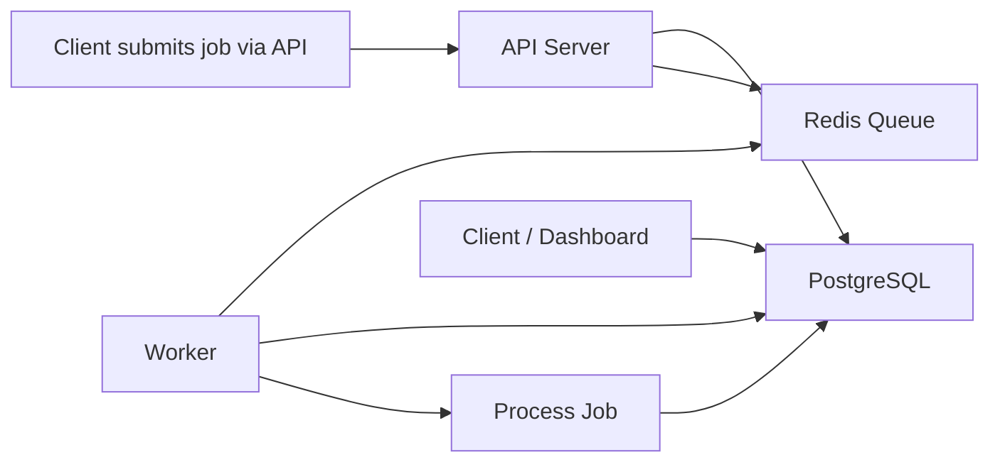

## Overview

## Repository structure
```
goqueue/
├── cmd/
│   ├── api/           # API Server - separate binary
│   ├── worker/        # Worker Service - separate binary
│   ├── scheduler/     # Scheduler Service - separate binary
├── internal/          # Shared internal code
│   ├── broker/
│   ├── storage/
│   ├── job/
│   └── models/
├── pkg/               # Public client library
│   └── client/
├── deployments/
│   ├── docker-compose.yml  # Run all 4 services
│   └── k8s/               # Separate deployments for each
└── Makefile
```
